<div align="center">


<h1>API-First Design Studio</h1>

<p><strong>Enterprise Platform for API Design, Governance, Code Generation, and Lifecycle Mastery</strong></p>

[](https://devopstrio.co.uk/)
[](/terraform)
[](/apps/governance-engine)
[](https://devopstrio.co.uk/)

</div>

---

## 🏛️ Executive Summary

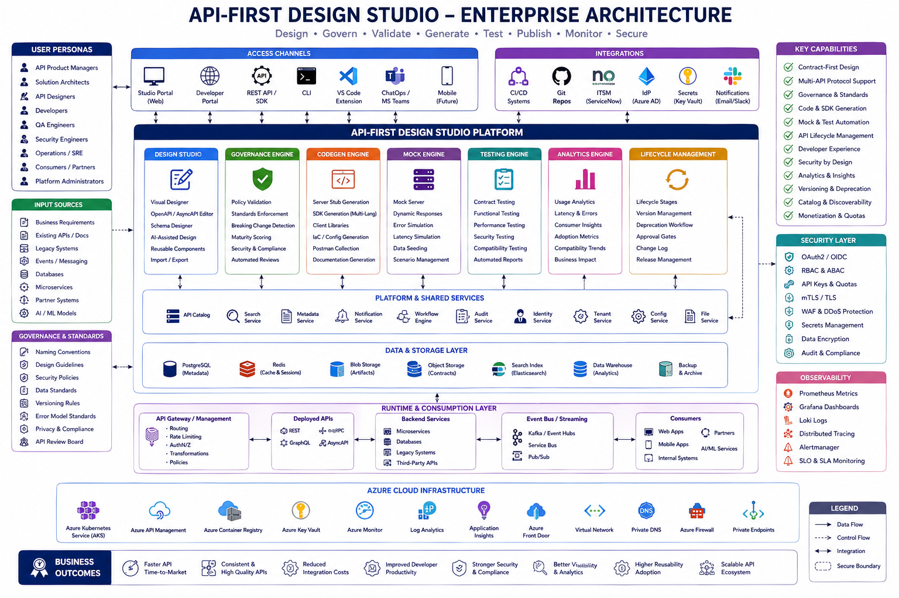

The **API-First Design Studio** enforces "Contract-First" engineering principles across the enterprise. It shifts API development left by separating contract definition and governance from backend implementation. By the time a developer writes backend code, the API has already been mathematically validated against security, naming, and architectural standards.

### Strategic Business Outcomes
- **Accelerated Time-to-Market**: Microservices teams can work in parallel using auto-generated Server Stubs and Mock Servers.
- **Strict Governance Checkmating**: The Governance Engine blocks deployment pipelines if contracts violate OpenAPI standards, pagination rules, or enterprise security headers.
- **Consumer Trust**: Backward-compatibility analysis prevents breaking changes before they hit production.
- **API Cataloging**: Single pane of glass Developer Portal for consuming internal, external, and partner APIs.

---

## 🏗️ Technical Architecture Details

### 1. High-Level Architecture
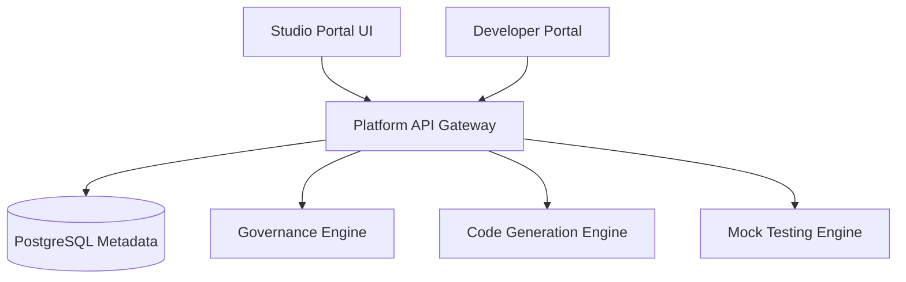

### 2. Contract-First Lifecycle
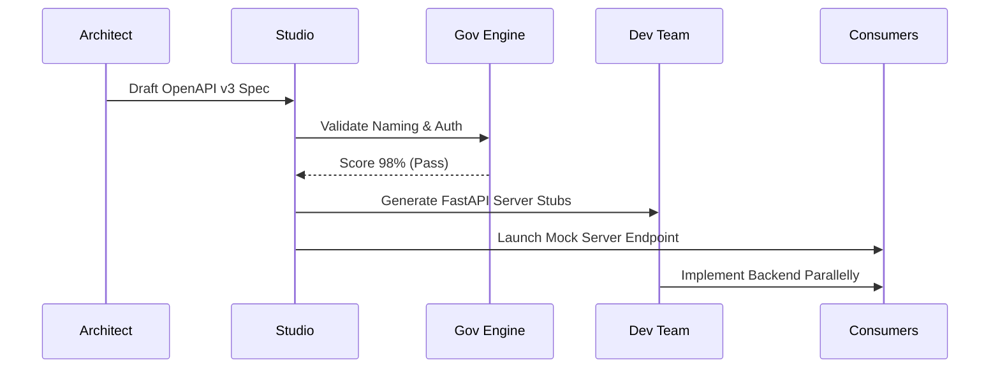

### 3. API Publish Workflow
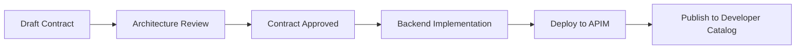

### 4. Governance Validation Flow
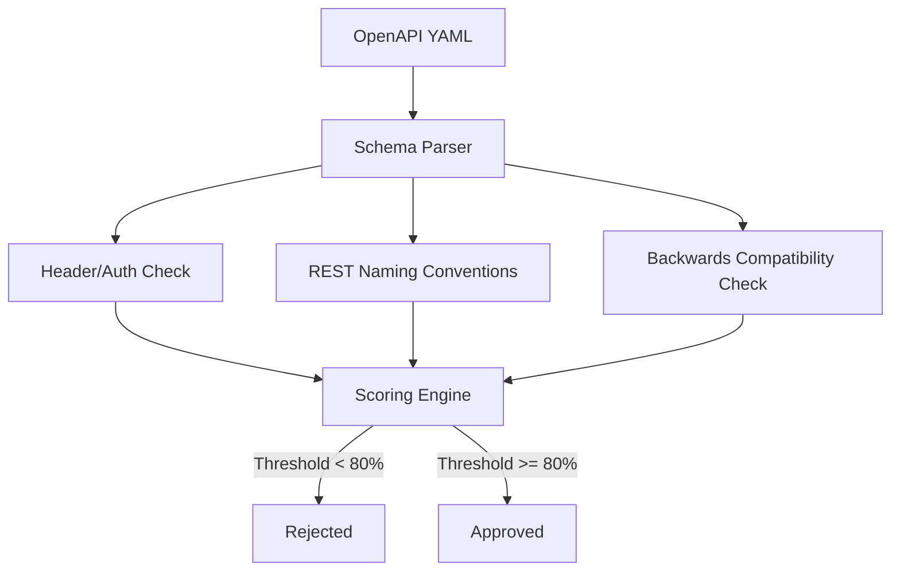

### 5. SDK Generation Flow
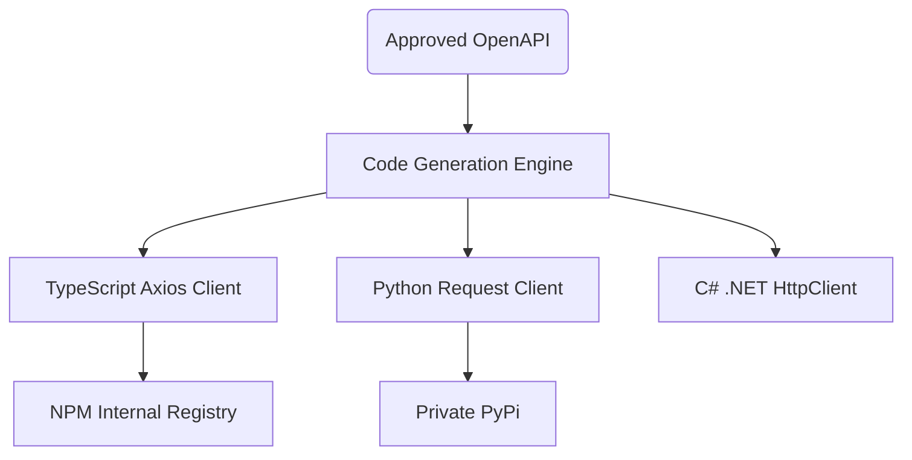

### 6. Mock Testing Flow
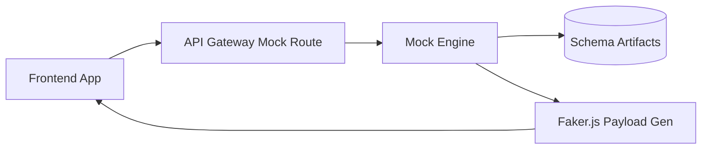

### 7. Security Trust Boundary
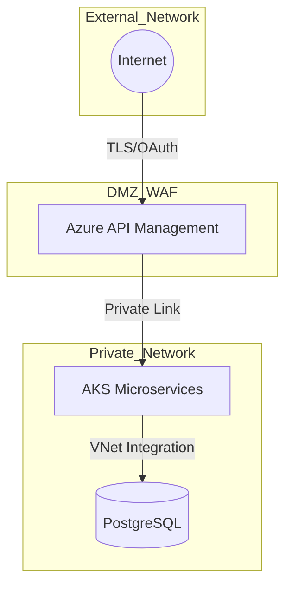

### 8. AKS Microservice Topology
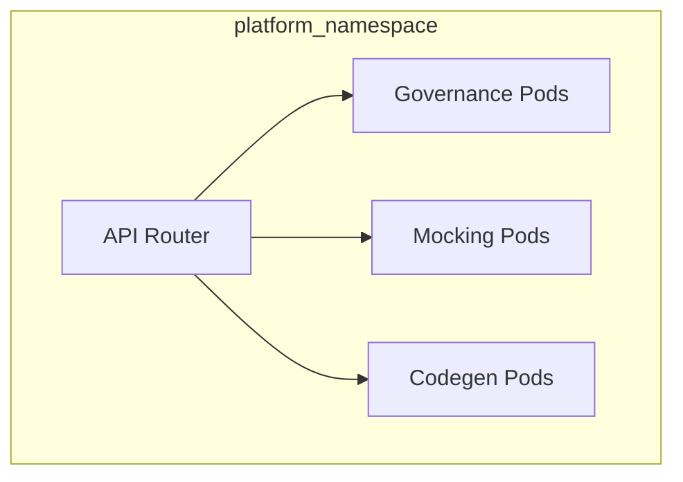

### 9. Request Routing Lifecycle
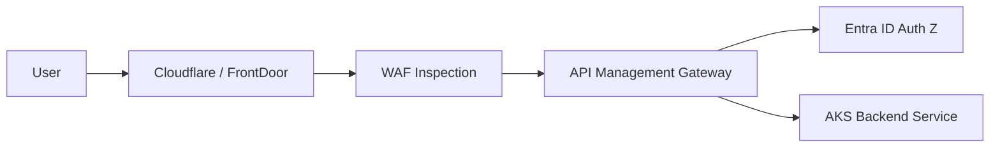

### 10. Contract CI/CD Pipeline
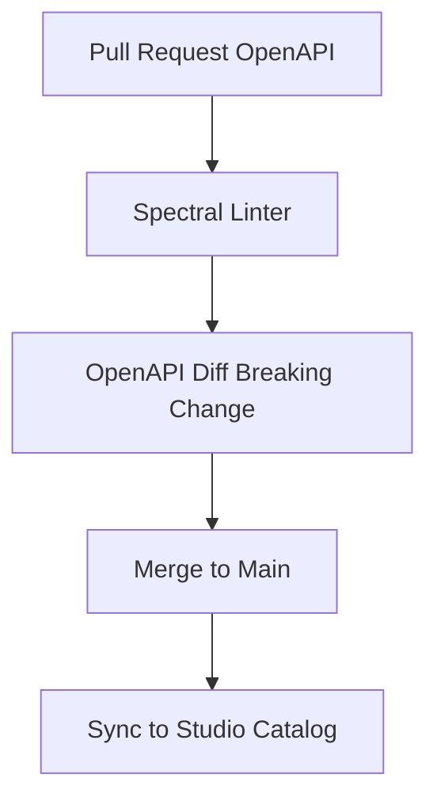

### 11. Multi-Tenant Architecture
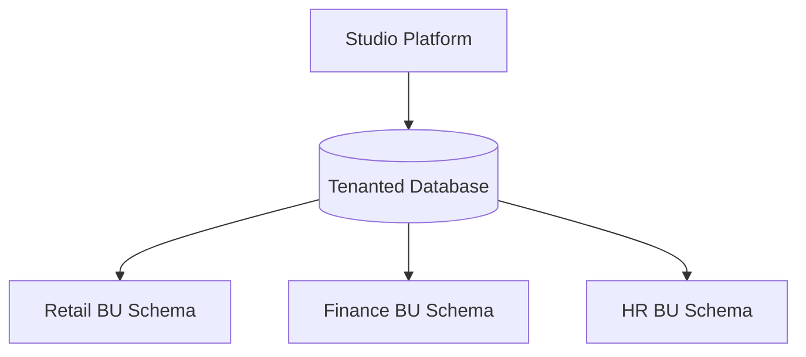

### 12. Developer Portal Onboarding
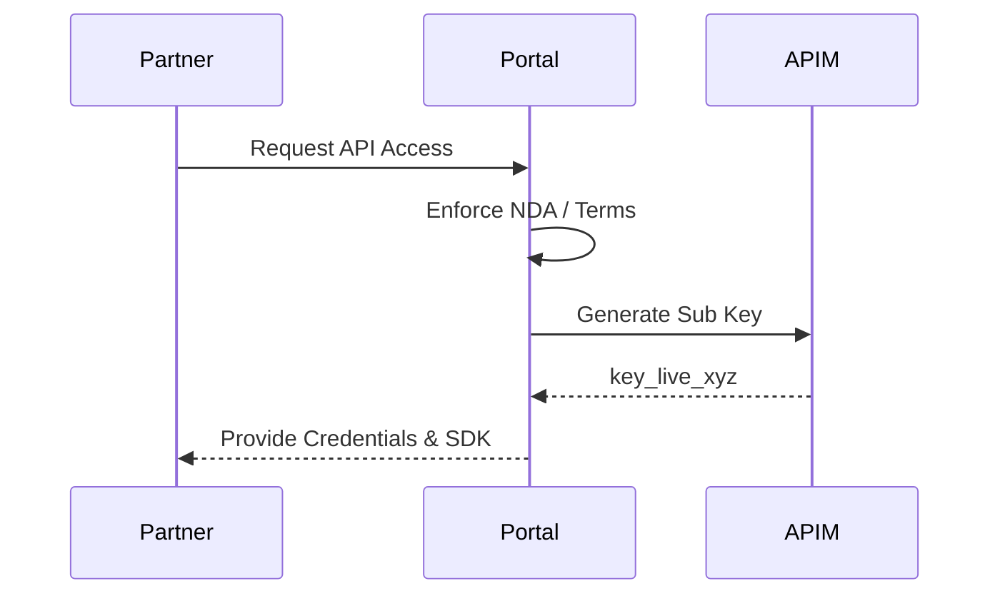

### 13. Analytics Data Flow
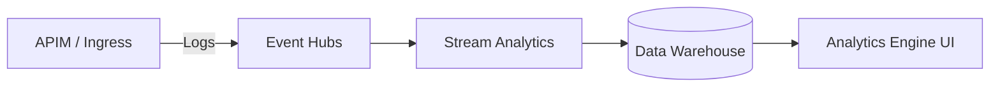

### 14. Version Migration Lifecycle
```mermaid
graph TD
    V1[v1.0 Active] --> V2[v2.0 Draft]
    V2 --> Publish[v2.0 Published]
    Publish --> Deprecate[v1.0 Deprecated (Header Warning)]
    Deprecate --> Sunset[v1.0 Sunset (410 Gone)]
```

### 15. Disaster Recovery Topology
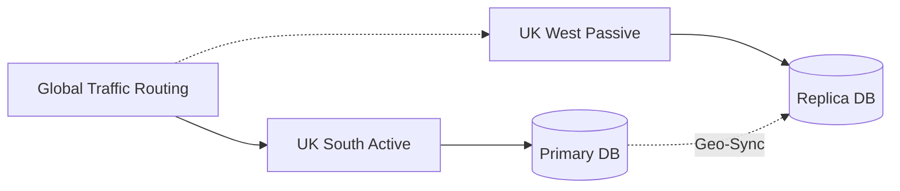

---

## 🛠️ Global Platform Components

| Engine | Directory | Purpose |
|:---|:---|:---|
| **Studio Portal** | `apps/studio-portal/` | Next.js visual designer and architect command center. |
| **API Gateway** | `backend/src/` | FastAPI central nervous system coordinating the engines. |
| **Governance Engine**| `apps/governance-engine/`| Validates OpenAPI artifacts against institutional RFCs. |
| **Codegen Engine** | `apps/codegen-engine/` | Auto-generates server stubs, SDKs, and Postman collections. |
| **Mock Engine** | `apps/mock-engine/` | Instantiates dynamic mock servers based on contract schemas. |
| **Developer Portal** | `apps/developer-portal/`| Consumer-facing catalog for discovery and onboarding. |

---

## 🚀 Deployment Operations

Provision the infrastructure using the provided Bicep or Terraform pipelines.

```bash
# Example Terraform Rollout
cd terraform/environments/prod
terraform init
terraform apply -auto-approve
```

---
<sub>&copy; 2026 Devopstrio &mdash; Managing the API Economy.</sub>
